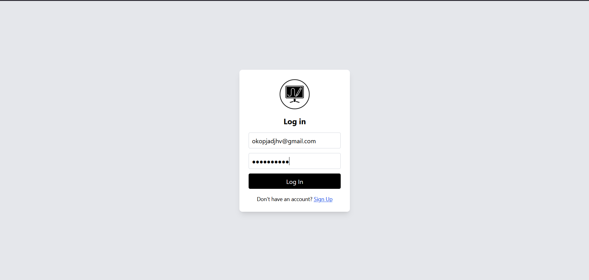
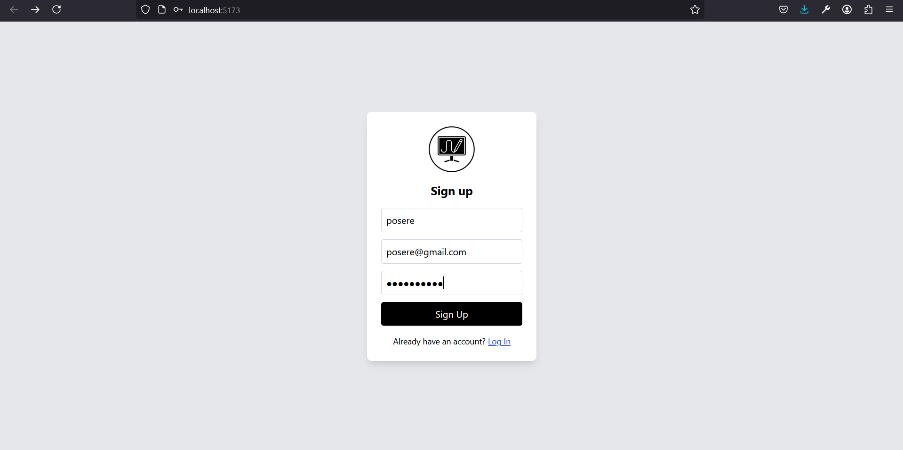
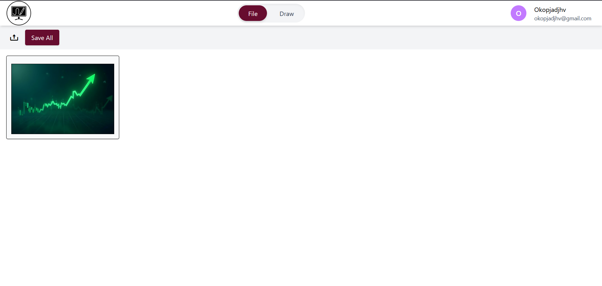
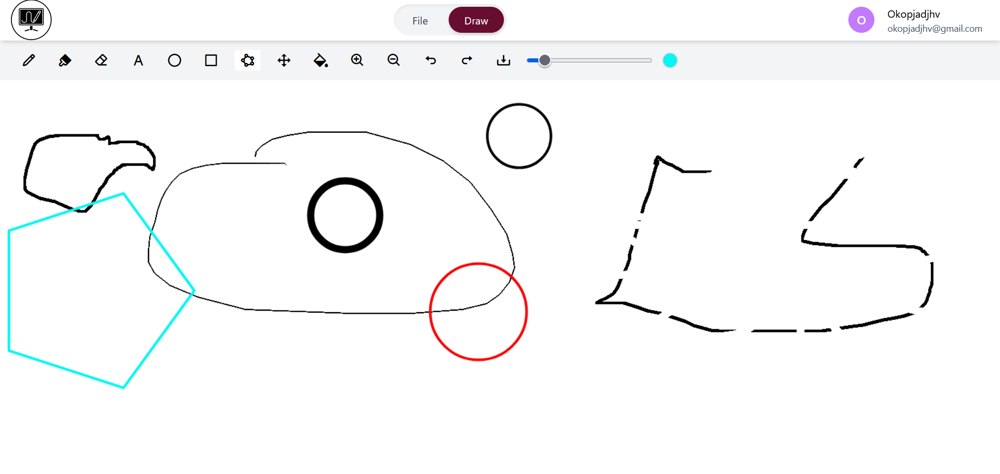
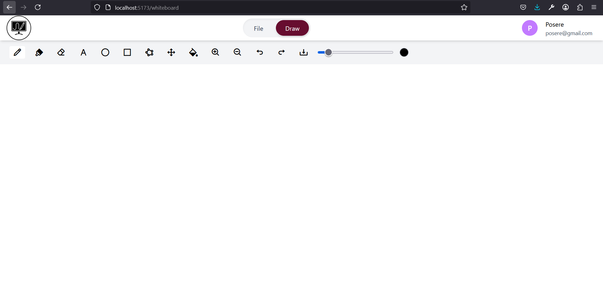

# 🖌️ Whiteboard App

A modern whiteboard and file management web app built with **React**, **TypeScript**, and **Tailwind CSS**.  
It features a dynamic drawing interface, an intuitive file tab for uploads, and a responsive login/signup flow — all in one seamless user experience.

---

---

## ✅ Features

- 🔐 Login and Signup with email and password validation
- ✏️ Drawing tools: Pencil, Brush, Eraser, Text, Shapes (circle, rectangle, polygon), Fill
- 🎨 Custom color picker and brush size slider
- ✋ Grab tool for canvas panning
- 🔄 Undo / Redo support
- 📥 Download canvas as PNG
- 📂 Upload and manage files in the File tab
- 🧭 Zoom In/Out

---

## 📸 Screenshots

### 🔐 Login Page

> Simple login form with validation

---

### 📝 Signup Page

> Email auto-extracts username

---

### 📂 File Tab

> Upload and preview images with "Save All" option

---

### 🎨 Draw Tab

> Powerful and responsive canvas with tools and undo/redo

---

## 💻 Tech Stack

- **Frontend Framework:** React (with Hooks)
- **Language:** TypeScript
- **Styling:** Tailwind CSS
- **Routing:** React Router
- **Color Picker:** `react-color`
- **File Download:** `file-saver`
- **Animation:** `framer-motion`

---
